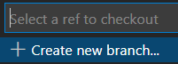
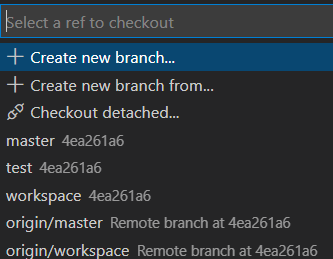
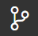
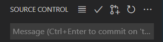
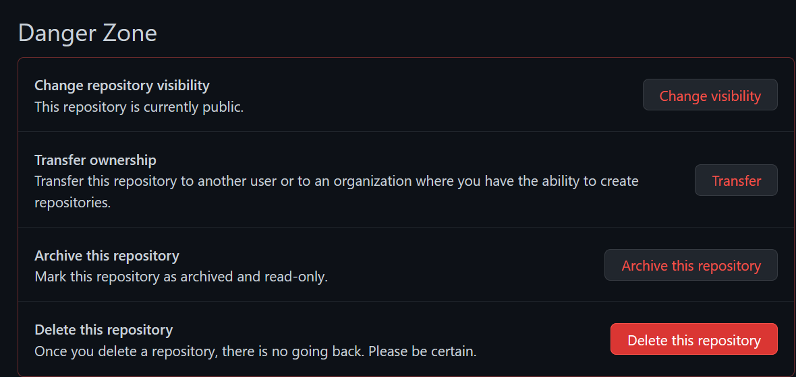
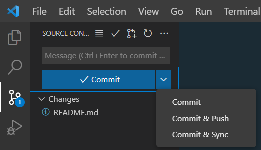
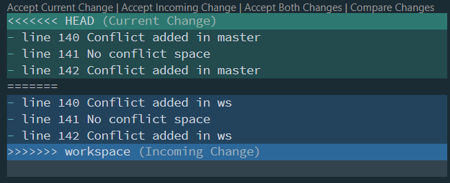
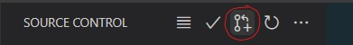
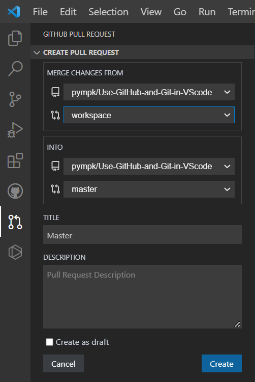
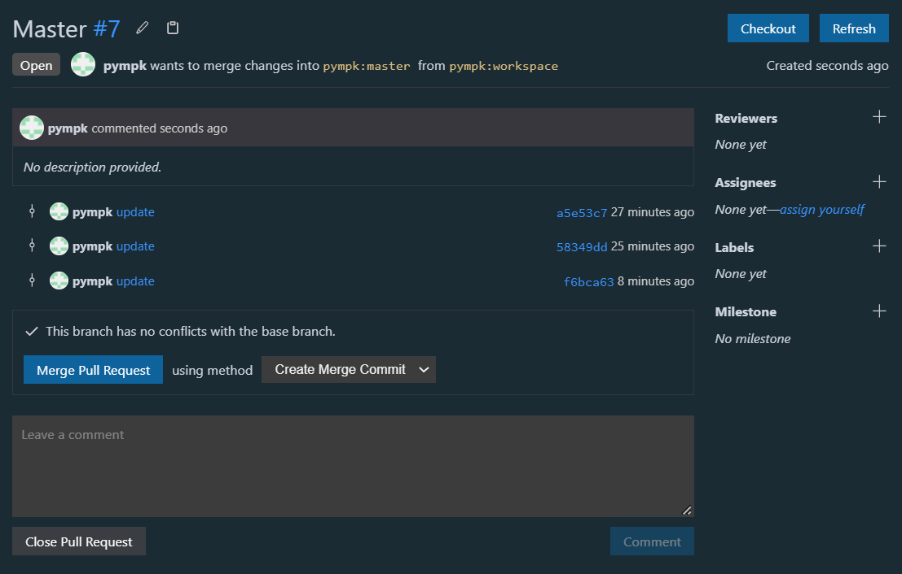

# Use GitHub and Git in VScode

These are my notes while learning to use GitHub and Git in VScode. I have copied some of the references and links verbatim to make it easier for me to read, and avoid switching between these notes and webpages.

### References

- [Use Git version-control tools in Visual Studio Code](https://docs.microsoft.com/en-us/learn/modules/use-git-from-vs-code/)
- [Introduction to GitHub in Visual Studio Code](https://docs.microsoft.com/en-us/learn/modules/introduction-to-github-visual-studio-code/)
- [Get started using GitHub to manage Git repositories and collaborate with others](https://docs.github.com/en/get-started/quickstart)

### [Forks, clones, and branches](https://docs.microsoft.com/en-us/learn/modules/use-git-from-vs-code/2-clone-branch)

If you clone someone else's GitHub repository and make some changes, you don't have permission to push those changes back to GitHub. The workflow for making contributions to other people's projects on GitHub requires that you create a fork.

A fork is a copy of a GitHub repository in your GitHub account. When you create a fork, you have full permissions to push changes to it, even if you don't have those permissions in the original repository.

A cloned repository is an entire copy of a remote repository (usually a forked repository) on your machine. It has all the commit history since the repository's creation. From this local copy, you will be able to create commits, branches, and synchronize those changes back to your remote repository.

A branch is a pointer to a specific commit. A commit has a parent, and is the parent of subsequent commits. It is often represented by the first 5 characters of a hash.

### Create a Fork

Forking takes place entirely within the GitHub web interface.

- Login to your GitHub account
- Go to the repository that your want to fork
- Select Fork near the upper right of the webpage
  > 

### Create a Clone

You want to clone from your own fork. This will configure Git on your computer to push your changes to the fork, where you have permissions to do so.

- Open Command Palette (Ctrl+Shift+P)
- In the Search box, enter **clone**
- Select **Git: Clone**
- At the prompt, enter the URL of the repository

### Create a branch

- Select branch icon on the bottom ribbon, left
  > 
- In the Dialog box, enter the new branch name
  > 

### Switch among branches

- Select branch icon on the bottom ribbon, left
  > 
- Select branch from the drop down list
  > 

### Delete a branch

- Switch to a branch that you want to keep
- Select Source Control Management (SCM) icon on the vertical ribbon, left
  > 
- Select **ellipsis** on the top SCM ribbon
  > 
- Select **Branch** on the drop down list
- Select **Delete Branch**
- Select the branch to delete

### [Create a repository](https://docs.microsoft.com/en-us/learn/modules/introduction-to-github-visual-studio-code/5-exercise-publish)

- Create a folder on your machine (e.g. **mslearn-demo**)
- In Visual Studio Code, select the File menu, and then select **Open Folder**
- Select the **mslearn-demo** folder that you created
- Create **README.md**
- Create .env file type (e.g. **.env.development**) that's confidential and should not be push (such as database connection strings) to GitHub.

### [Publish repository to GitHub](https://docs.microsoft.com/en-us/learn/modules/introduction-to-github-visual-studio-code/5-exercise-publish)

- Open the Source Control Management (SCM) view by selecting the SCM icon on the activity bar
  > 
- Select Publish to GitHub
  > 
- Select **Publish to GitHub public repository**
- **Uncheck confidential files** that should not push to GitHub
- Open **.gitingore**, the confidential file (e.g. **.env.development**) is listed there.
- Add confidential file to **.gitingore** by preceding the filename with **"/"** (e.g. **/.env.development**)

### Delete a repository

- Delete repository folder in Windows (need to provide administrator permission)
- Open the repository in GitHub
- Select **Settings**
  > 
- Scroll down to **Danger Zone**
  > 
- Select **Delete this repository** and following the instruction

[Clone an existing repository](https://docs.microsoft.com/en-us/learn/modules/introduction-to-github-visual-studio-code/6-lesson-clone)

- Open a new window (Ctrl+Shift+N)
- Select **Explorer** (Ctrl+Shift+E)
- Select **Clone Repository**
  > 
- Provide repository URL in dialog box
- Select repository location in Windows File Explorer

[Create a fork of an open-source project in GitHub](https://docs.microsoft.com/en-us/learn/modules/use-git-from-vs-code/3-exercise-clone-branch)

- Navigate to open-source project repository in GitHub
- Select **Fork** near the upper right of the webpage
  > 

### View staged and unstaged changes

- Select Source Control Management (SCM) icon, shown with pending changes, on the left vertical ribbon

  > 

- Under **Changes** are files with unstaged changes. To the right of the file name are four icons:

  - File icon: Select to open and display the file in the main editor pane
  - Counterclockwise arrow icon: Select to discard changes and revert the file to its state in the previous commit
  - Plus sign (+) icon: Select to stage your changes to be committed
  - "M" or "U" icon:

    - "M" Indicates that this file existed previously and has been modified
    - "U" Indicates that this file is untracked
    - "D" Indicates that this file has been deleted

- Under **Staged Changes**, to the right of the file name are **"M"** or **"A"**:
  - "M" Indicates that this file existed previously and has been modified
  - "A" Indicates that this file is added

### Stage, unstaged the changed file

- [View staged and unstaged changes](#view-staged-and-unstaged-changes)
- Staged changes
  - Select the plus sign (+) to move the file to a new section titled **Staged Changes**
- Unstaged changes
  - Select the minus sign (-) to move the file to a new section titled **Changes**

### [Commit choices](https://stackoverflow.com/questions/30038999/differences-between-commit-commit-and-push-commit-and-sync)

- To see the commit choices, select Commit drop down

  > 

  - Commit will simply make a record of your changes that you have made on your local machine. It will not mark the change in the remote repository.
  - Commit and Push will do the above and push it to the remote repository. This means that any changes you have made will be saved to the remote repository as well. If there are conflicts with the remote repository, you will get an error message:
    - Can't push refs to remote. Try running "Pull" first to integrate your changes.
  - Commit and Sync do three things. First, it will commit. Second, it will perform a pull (grabs the updated information from the remote repo). Finally, it will push. This is the choice for most cases.

### [Create a commit](https://docs.microsoft.com/en-us/learn/modules/use-git-from-vs-code/5-exercise-stage-commit)

- Select Source Control Management (SCM) icon, shown with pending changes, on the left vertical ribbon

  > 

- Add a commit message in the text box below the checkmark icon

- To complete the commit, select Enter or select the checkmark icon

### Synchronize Changes

- Select Synchronize Changes (two clockwise arrows) icon in the Status Bar
  > 
  > The Status Bar indicates Synchronize Changes will pull 2 and push 1 commits to remote repository

### Merge local branches

This is similar to [GitHub Pull Request](#github-pull-request), except the merge is done on branches of the local repository, where as GitHub Pull Request is merged on the branches of the remote repository.

- Open Command Palette (Ctrl+Shift+P)
- Type: **Git: Merge Branch**
- Select a branch to merge from in the list

- [Dominant branch when doing a merge](https://stackoverflow.com/questions/42099431/what-is-the-dominant-branch-when-doing-a-git-merge/42104116#42104116)

  - Note:

    - **we** is the current branch, also refer to as: HEAD, Current Change
    - **they** is the branch to merge from, also refer to as: incoming branch, Incoming Change
    - **change** not only applies to line number in a file, it also applies to filename

  - If we changed line 1 and they didn't, the merge result is our version.

  - If we didn't change line 1, and they did, the merge result is their version.

  - If we both changed line 1, the merge result is that the merge fails, with a merge conflict. Git writes both lines into the file and stops the merge with an error, and makes us clean up the mess:
    > 

- Merge **deletes files** in current branch if the file is deleted in the merge from branch
- Merge ignores uncommitted changes

### GitHub Pull Request

[A pull request in GitHub is a request to the maintainer of a repository to pull in some code](https://www.dummies.com/article/technology/programming-web-design/general-programming-web-design/what-are-github-pull-requests-264741/)

- [Switch to master branch](#Switch-among-branches)
- Open Source Control (Ctrl+Shift+G)
- Select Create Pull Request icon

  > 

- GitHub Pull Request Panel opens
  > 
- URL for the remote repository is displayed on the top rows of the MERGE CHANGES FROM box and the INTO box
- Select a branch to MERGE CHANGES FROM in the drop down list
- Select a branch to merge INTO in the drop down list
- Add Pull Request Description
- Select **Create**
- Pull Request opens
  > 
- Select **Merge Pull Request**
- Select **Create Merge Commit**
